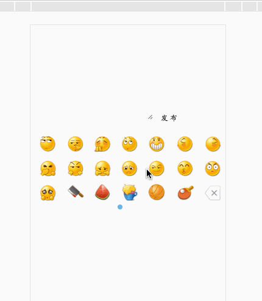

###use
```
1.支持ADM CMD
  var face=new Face({
        elemObj: document.getElementById('text'),
        emojiBox: document.getElementById('emoji-box')
    });
  face.init();
  document.getElementById('release').onclick=function () {
      document.getElementById('text-show').innerHTML=face.compileFace();
  }
  ```
  